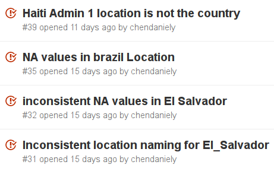

```{r setup, include=FALSE}
library(revealjs)
knitr::opts_chunk$set(echo = TRUE)
```

# Hi!

## I'm Daniel


>- "Guniness beer in your belly." - Julia, my sister

## Who am I?

- Graduate Student @ Virginia Tech
    - Social and Decision Analytics Laboratory
    - Network Dynamics and Simulation Science Laboratory
- Software/Data Carpentry Instructor
    - R Inflammation-Lesson Maintainer 
- Arch User Repository (AUR) maintainer for  
    `rstudio-desktop-preview-bin`
- Data Scientist @ Lander Analytics

## This talk

>- is about testing

## What do you test?

>- Anything
>- Everything
>- Functions
>- Data
>- scripts

## tl;dr

- `RUnit` - Roman Zenka
- `testthat` - Hadley Wickham
- <del>`datacheck`</del> Reinhard Simon
- `validate` - Mark van der Loo

# Testing Functions

## Testing Functions

Define a temperature conversion function.

```{r}
# convert Faherenheit to Kelvin
f_k <- function(temp){
    ((temp - 32)) * floor(5/9) + 273.15
}
```

## Testing Functions

```{r}
f_k(32)
```

## Testing Functions

```{r}
f_k(212)
```


## What went wrong?

```{r}
# convert Faherenheit to Kelvin
f_k <- function(temp){
    ((temp - 32)) * floor(5/9) + 273.15
}
```

```{r}
# convert Faherenheit to Kelvin, correctly
f_k <- function(temp){
    ((temp - 32)) * (5/9) + 273.15
}
```

```{r}
print(sprintf("%f, %f", f_k(32), f_k(212)))
```

# Automate tests -- `RUnit`

## Automate tests -- `RUnit`

I stole this from [John Myles White](http://www.johnmyleswhite.com/notebook/2010/08/17/unit-testing-in-r-the-bare-minimum/)

```{r}
test_examples <- function(){
  checkEquals(273.15, f_k(32))
  checkEqualsNumeric(373.15, f_k(3))
}
```

- Save this to a file under `tests` directory

- The first set of tests will be called `1.R`

## Automate tests -- `RUnit`
From the docs:

`defineTestSuite` is a helper function to define a test suite.

`runTestSuite` ...Given one or more test suites it identifies and sources specified test code files one after another and executes all specified test functions defined therein...

<hr>

`runTestFile` is just a convenience function for executing the tests in a single test file.

`isValidTestSuite` checks if an object defines a valid test suite.

## Automate tests -- `RUnit`

```{r}
library('RUnit')
source('src/f_k.R')
source('tests/1.R')

f_k

test_examples
```

## Automate tests -- `RUnit`

```{r}
test.suite <- defineTestSuite(name = "RUnit",
                              dirs = file.path("tests"),
                              testFileRegexp = '^\\d+\\.R')
test.result <- runTestSuite(test.suite)
```

## Automate tests -- `RUnit`

```{r}
printTextProtocol(test.result)
```

# Automate tests -- `testthat`

## Automate tests -- `testthat`

- save your test files under the `tests/testthat` directory
- your test files should begin with `test`
    - `test_f_k.R`
    - `test_temp_converstion.R`

## Automate tests -- `testthat`

```{r}
library(testthat)
source('src/f_k.R')

test_that("Faherenheit to Kelvin converts correctly", {# note bracket
    expect_equal(273.15, f_k(32))
    expect_equal(373.15, f_k(212))
})
```

## Autotomate tests -- `testthat`
That just ran it.

To have a complete file you need `context`

```{r}
writeLines(readLines('tests/testthat/test_f_k.R'))
```

## Autotomate tests -- `testthat`

```{r}
library(testthat)
source('src/f_k.R')

testthat::test_dir('tests/testthat/')
```

# Testing Data

## Zika

## Zika Data


https://github.com/cdcepi/zika

## Zika Data Quality



up to three hierarchical levels in the following format:

<small>`[country]-[state/province]-[county/municipality/city]`</small>

always beginning with the country name

## Zika Data

```{r, echo=FALSE}
rm(list = ls())
```

```{r}
load('data/zika.RData')

dplyr::sample_n(parsed_location, 10)
```

## Zika Data

Shameless plug:

https://chendaniely.shinyapps.io/zika_cdc_dashboard/

https://github.com/chendaniely/zika_dashboard_cdc

## Zika Data

`global.R`

```{r, eval=FALSE}
files <- list.files(path = sprintf('data/zika-%s', cdc_data_commit),
                    pattern = '[0-9]{4}-[0-9]{2}-[0-9]{2}.csv$',
                    recursive = TRUE,
                    full.names = TRUE)

tables <- lapply(files, readr::read_csv)

combined_df <- do.call(rbind , tables)

parsed_location <- combined_df %>%
    tidyr::separate(col = location,
                    into = c('country', 'location2', 'location3'),
                    sep = '-',
                    fill = 'right')

```

## Zika Data

```{r, message=FALSE}
library(dplyr)
el_salvador <- parsed_location %>%
    filter(country == "El_Salvador")

el_salvador
```

## El Salvador

```{r}
el_salvador$country %>% unique()
```

```{r}
el_salvador$country %>% unique() %>% length()
```

```{r}
el_salvador$country %>% table(useNA = 'always')
```

# Testing data -- `validate`

## Testing data -- `validate` -- installation

```{r, eval=FALSE}
install.packages("validate")
```

Totally just using the vignette:

https://cran.r-project.org/web/packages/validate/vignettes/intro.html

## Testing data -- `validate`

`data set`: your data

`validator` an object representing a set of rules your data must satisfy

`confrontation` an object representing the results of confronting data with rules

`confront`: evaluate the validation rules in the context of one or more data sets.

## Testing data -- `validate`

average heights and weighs for American women aged 30-39

```{r}
data(women)
summary(women)
head(women)
```

## Testing data -- `validate`

```{r, message=FALSE}
library(validate)

women %>%
    validate::check_that(height > 0,
               weight > 0,
               height/weight > 0.5) %>%
    validate::summary()
```

## Testing data -- `validate`

```{r}
data_validataion <- women %>%
    validate::check_that(height > 0,
               weight > 0,
               height/weight > 0.5)
```

## Testing data -- `validate`

```{r, fig.height=5}
validate::barplot(data_validataion, main='woman dataset validation')
```

## Testing data -- `validate`

```{r}
v <- validator(
    # := in this case is assigning a new variable on the fly
    BMI := (weight*0.45359)/(height*0.0254)^2,
    height > 0,
    weight > 0,
    BMI < 23,
    mean(BMI) > 22 & mean(BMI) < 22.5
)
v
```

## Testing data -- `validate`

```{r}
cf <- confront(women,v)
summary(cf)
```

## Testing data -- `validate`

```{r, fig.height=5}
validate::barplot(cf, main='woman dataset validation with BMI')
```

# Thanks!

## Thanks!

@chendaniely

https://github.com/chendaniely/2016-04-08-rstatsnyc_testing
